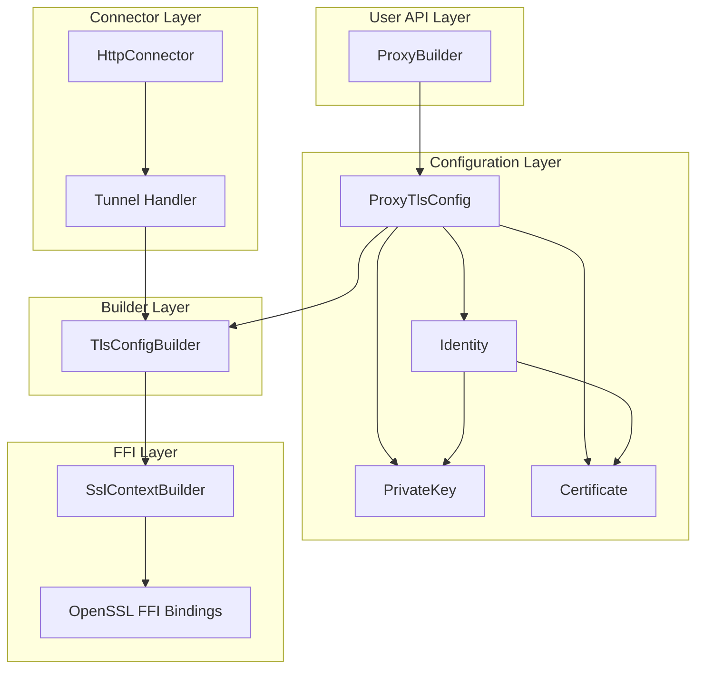
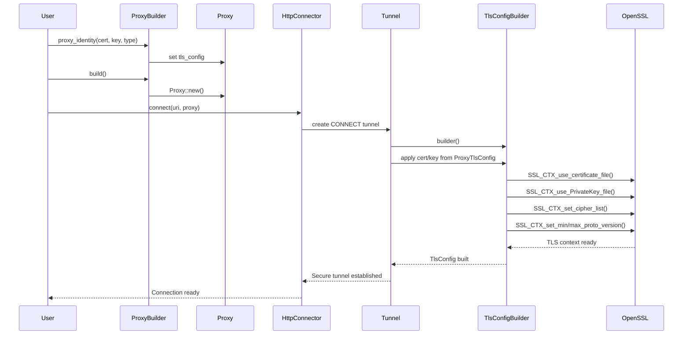
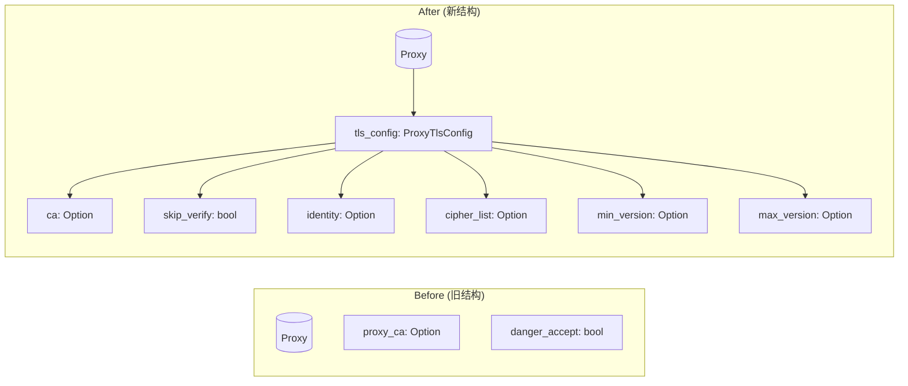
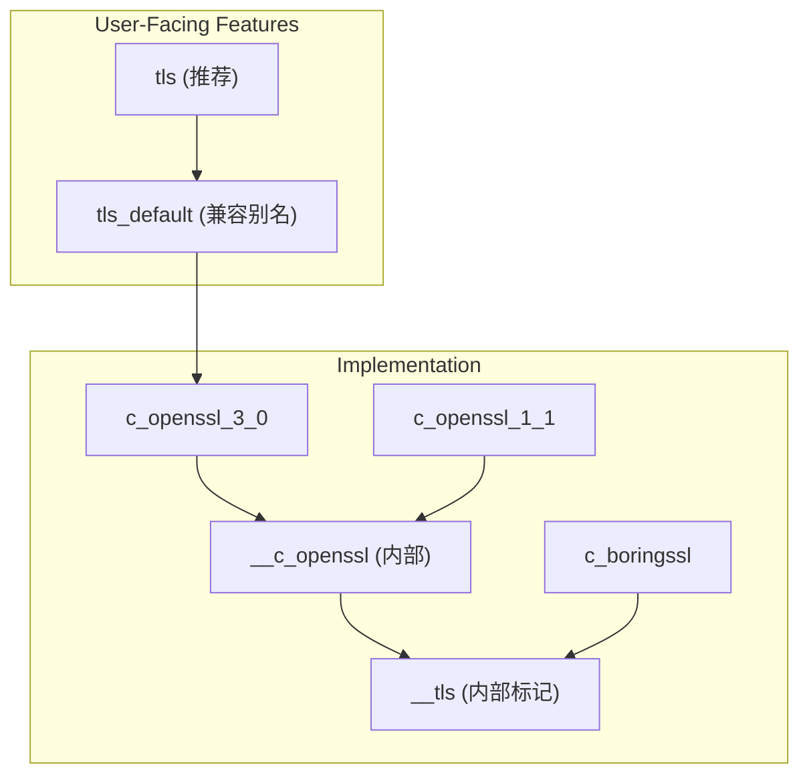

# HTTPS 代理 TLS 配置增强 - 总结报告

## 一、概述

### 1.1 任务目标

为 ylong_http_client 的 HTTPS 代理添加完整的 TLS 配置支持，实现以下功能：

- 支持 TLS 单向/双向证书验证
- 支持设置代理服务器相关的 TLS 配置（客户端证书、私钥、算法套件等）
- 依赖 OpenSSL 组件实现 TLS 相关能力

### 1.2 约束条件

- 用户明确要求**忽略所有 sync 实现**，只关注 async 实现
- 保持向后兼容性
- 所有新代码需要 `#[cfg(feature = "__tls")]`

---

## 二、架构设计

### 2.1 整体架构图



### 2.2 数据流时序图



---

## 三、数据结构设计

### 3.1 新旧结构对比



### 3.2 核心数据结构

#### ProxyTlsConfig

```rust
#[cfg(feature = "__tls")]
#[derive(Clone, Default)]
pub(crate) struct ProxyTlsConfig {
    pub ca: Option<Certificate>,           // CA 证书
    pub skip_verify: bool,                // 是否跳过验证
    pub identity: Option<Identity>,       // 客户端身份（证书+私钥）
    pub cipher_list: Option<String>,      // 加密套件
    pub min_version: Option<TlsVersion>,  // 最低 TLS 版本
    pub max_version: Option<TlsVersion>,  // 最高 TLS 版本
}
```

#### Identity (创新点)

```rust
#[cfg(feature = "__tls")]
#[derive(Clone, Default)]
pub(crate) struct Identity {
    cert: Certificate,  // 客户端证书
    key: PrivateKey,     // 私钥
}
```

#### PrivateKey

```rust
#[cfg(feature = "__tls")]
#[derive(Clone)]
pub(crate) struct PrivateKey {
    path: String,           // 私钥文件路径
    file_type: TlsFileType, // 文件类型 (PEM/ASN1)
}
```

---

## 四、API 设计

### 4.1 新增 API

| 方法 | 功能 | 示例 |
|------|------|------|
| `proxy_identity()` | mTLS 身份设置 | `proxy_identity("cert.pem", "key.pem", TlsFileType::PEM)` |
| `proxy_cipher_list()` | 加密套件 | `proxy_cipher_list("ECDHE-RSA-AES256-GCM-SHA384")` |
| `proxy_min_proto_version()` | 最低 TLS 版本 | `proxy_min_proto_version(TlsVersion::TLS_1_2)` |
| `proxy_max_proto_version()` | 最高 TLS 版本 | `proxy_max_proto_version(TlsVersion::TLS_1_3)` |

### 4.2 API 使用流程图

```mermaid
graph LR
    A["Proxy::all(https://proxy:443)"] --> B["proxy_ca_file(ca.pem)"]
    B --> C["proxy_identity(cert.pem, key.pem, PEM)"]
    C --> D["proxy_cipher_list(ECDHE-...)"]
    D --> E["proxy_min_proto_version(TLS_1_2)"]
    E --> F["proxy_max_proto_version(TLS_1_3)"]
    F --> G["danger_accept_invalid_proxy_certs(false)"]
    G --> H[".build()"]
    
    style A fill:#e1f5fe
    style H fill:#c8e6c9
```



### 4.3 使用示例

```rust
use ylong_http_client::{Proxy, TlsFileType, TlsVersion};

// 单向认证（仅验证代理服务器）
let proxy = Proxy::all("https://proxy.example.com:443")
    .proxy_ca_file("corporate-ca.pem")
    .build()?;

// 双向认证（mTLS）
let proxy = Proxy::all("https://proxy.example.com:443")
    .proxy_ca_file("corporate-ca.pem")
    .proxy_identity("client-cert.pem", "client-key.pem", TlsFileType::PEM)
    .build()?;

// 自定义加密套件和协议版本
let proxy = Proxy::all("https://proxy.example.com:443")
    .proxy_cipher_list("ECDHE-RSA-AES256-GCM-SHA384")
    .proxy_min_proto_version(TlsVersion::TLS_1_2)
    .proxy_max_proto_version(TlsVersion::TLS_1_3)
    .build()?;
```

---

## 五、Feature Gate 架构

### 5.1 Feature 层次结构



### 5.2 Feature 说明

| Feature | 用途 | 层级 |
|---------|------|------|
| `tls` | 用户级，推荐使用 | 用户 |
| `tls_default` | 向后兼容别名 | 用户 |
| `__tls` | 内部实现标记 | 内部 |
| `__c_openssl` | C OpenSSL 实现标记 | 内部 |
| `c_openssl_3_0` | OpenSSL 3.0 实现 | 实现 |
| `c_openssl_1_1` | OpenSSL 1.1 实现 | 实现 |

---

## 六、改进与创新

### 6.1 新旧设计对比

| 方面 | 旧设计 | 新设计 | 改进点 |
|------|--------|--------|--------|
| **mTLS 支持** | 不支持 | 完整支持 | `proxy_identity()` 强制同时设置证书和私钥 |
| **API 一致性** | 不一致 | 统一 | TLS/非TLS 模式统一返回错误 |
| **配置查询** | 不可查询 | 可查询 | `Proxy::tls_config()` getter |
| **路径验证** | 延迟验证 | 构建时验证 | `Certificate::from_path` 增加文件存在性检查 |
| **Feature 命名** | `tls_default` | `tls` + 别名 | 更直观 |
| **代码复用** | 分散 | 统一 | `Identity` 结构体封装证书+私钥 |

### 6.2 关键创新点

#### 1. Identity 模式

将证书和私钥捆绑为 `Identity`，确保匹配且操作原子化：

```rust
// 旧的分开设置方式（已废弃）
.proxy_certificate_file("cert.pem", TlsFileType::PEM)
.proxy_private_key_file("key.pem", TlsFileType::PEM)

// 新的 Identity 模式
.proxy_identity("cert.pem", "key.pem", TlsFileType::PEM)
```

#### 2. Feature 统一

暴露 `tls` 作为标准名称，`tls_default` 作为兼容别名：

```toml
tls = ["c_openssl_3_0"]           # 新标准名称
tls_default = ["tls"]              # 向后兼容别名
```

#### 3. 构建时验证

文件路径在 `build()` 时验证，而非连接时：

```rust
pub fn from_path(path: &str) -> Result<Self, HttpClientError> {
    if !std::path::Path::new(path).exists() {
        return Err(HttpClientError::from_str(
            ErrorKind::Build,
            "Certificate file not found",
        ));
    }
    Ok(Certificate { ... })
}
```

#### 4. 双向 Feature Gate

每个 TLS 方法都有 TLS/非TLS 双版本，行为一致：

```rust
#[cfg(feature = "__tls")]
pub fn proxy_identity(...) -> Self { ... }

#[cfg(not(feature = "__tls"))]
pub fn proxy_identity<T, U>(...) -> Self {
    Err("TLS not enabled, cannot set proxy identity")
}
```

---

## 七、文件变更清单

### 7.1 新增文件

| 文件路径 | 说明 |
|----------|------|
| `src/util/config/proxy_tls_config.rs` | ProxyTlsConfig、Identity、PrivateKey 结构体 |
| `ylong_http_client/tests/common/mitmproxy.rs` | mitmproxy Docker 容器管理模块 |
| `ylong_http_client/tests/sdv_async_https_proxy_e2e.rs` | HTTPS 代理 TLS 配置 E2E 测试 |

### 7.2 修改文件

| 文件路径 | 修改内容 |
|----------|----------|
| `src/util/c_openssl/ffi/ssl.rs` | 添加 SSL_CTX_use_PrivateKey_file FFI 绑定 |
| `src/util/c_openssl/ssl/ctx.rs` | 添加 set_private_key_file 方法 |
| `src/util/c_openssl/ssl/filetype.rs` | 添加 Default derive |
| `src/util/c_openssl/ssl/version.rs` | 添加 Clone derive |
| `src/util/c_openssl/adapter.rs` | 扩展 TlsConfigBuilder，添加 Default derive |
| `src/util/config/proxy_tls_config.rs` | 新增数据结构 |
| `src/util/config/mod.rs` | 导出新类型 |
| `src/util/config/settings.rs` | 添加新 API 方法 |
| `src/util/proxy.rs` | 添加 tls_config 字段和 getter |
| `src/async_impl/connector/mod.rs` | 集成 ProxyTlsConfig |
| `examples/async_https_proxy.rs` | 更新示例 |
| `Cargo.toml` | 添加 tls feature 和示例注册 |

---

## 八、测试结果

### 8.1 单元测试

| 模式 | 通过 | 失败 |
|------|------|------|
| TLS 模式 | 146 | 0 |
| 非 TLS 模式 | 73 | 0 |

### 8.2 E2E 测试 (mitmproxy)

通过 mitmproxy Docker 容器进行完整的端到端测试：

| 测试项 | 说明 | 结果 |
|--------|------|------|
| `sdv_async_https_proxy_mitmproxy_skip_verify` | HTTP 代理 + 跳过证书验证 | ✓ PASSED |
| `sdv_async_https_proxy_mitmproxy_mtls` | HTTPS 代理 + mTLS 双向认证 | ✓ PASSED |
| `sdv_async_https_proxy_mitmproxy_custom_ciphers` | HTTPS 代理 + 自定义加密套件 | ✓ PASSED |
| `sdv_async_https_proxy_mitmproxy_tls_version` | HTTPS 代理 + TLS 版本限制 | ✓ PASSED |

#### 测试环境

```bash
OPENSSL_LIB_DIR=/usr/lib/x86_64-linux-gnu \
OPENSSL_INCLUDE_DIR=/usr/include \
RUSTFLAGS="-L /usr/lib/x86_64-linux-gnu" \
cargo test --test sdv_async_https_proxy_e2e \
  --features "async http1_1 tls ylong_base" \
  -- --test-threads=1 --nocapture
```

#### 测试架构

```
┌─────────────────────────────────────────────────────────────────┐
│                      E2E Test Architecture                       │
├─────────────────────────────────────────────────────────────────┤
│                                                                  │
│   Test Process                    Docker Container               │
│   ───────────                    ─────────────────              │
│                                                                  │
│   ┌──────────────┐                ┌─────────────────┐           │
│   │ Upstream     │◄───────────────│    mitmproxy    │           │
│   │ HTTP Server  │   HTTP/S      │   (中间人代理)    │           │
│   │ :port        │                │   --network=host│           │
│   └──────────────┘                └────────┬────────┘           │
│         ▲                                  │                     │
│         │                                  │                     │
│         │                                  ▼                     │
│         │                         ┌─────────────────┐             │
│         └─────────────────────────│   ylong_http    │             │
│                   HTTP           │   HTTP Client   │             │
│                                   └─────────────────┘             │
│                                                                  │
│   使用 --network=host 确保 mitmproxy 能直接访问宿主机端口          │
└─────────────────────────────────────────────────────────────────┘
```

#### 测试用例详情

**1. HTTP 代理 + 跳过证书验证**
```
配置:
  Proxy URL: http://127.0.0.1:<port>
  TLS Verify: SKIPPED (danger_accept_invalid_proxy_certs=true)
  Upstream: HTTP server

步骤:
  1. 启动上游 HTTP 服务器
  2. 启动 mitmproxy 容器
  3. 构建跳过证书验证的代理配置
  4. 发送 HTTP 请求通过代理
  5. 验证响应状态码 200
```

**2. HTTPS 代理 + mTLS 双向认证**
```
配置:
  Proxy URL: https://127.0.0.1:<port>
  TLS Verify: SKIPPED (for mitmproxy CA)
  Client Auth: mTLS (client certificate required)
  Certificate: tests/file/cert.pem
  Private Key: tests/file/key.pem

步骤:
  1. 启动上游 HTTP 服务器
  2. 启动 mitmproxy (--set request_client_cert=true)
  3. 构建带客户端证书的代理配置
  4. 发送请求，完成 TLS 握手
  5. 验证响应状态码 200
```

**3. HTTPS 代理 + 自定义加密套件**
```
配置:
  Proxy URL: https://127.0.0.1:<port>
  Cipher Suite: ECDHE-RSA-AES256-GCM-SHA384

步骤:
  1. 启动上游 HTTP 服务器
  2. 启动 mitmproxy 容器
  3. 构建带自定义加密套件的代理配置
  4. 发送请求，TLS 握手使用指定加密套件
  5. 验证响应状态码 200
```

**4. HTTPS 代理 + TLS 版本限制**
```
配置:
  Proxy URL: https://127.0.0.1:<port>
  Min TLS Version: TLS 1.2
  Max TLS Version: TLS 1.3

步骤:
  1. 启动上游 HTTP 服务器
  2. 启动 mitmproxy 容器
  3. 构建带 TLS 版本限制的代理配置
  4. 发送请求，TLS 版本在指定范围内
  5. 验证响应状态码 200
```

---

## 九、Git 提交历史

```
ca8a3ee Fix UpstreamServer shutdown panic
7c17602 Add E2E tests for HTTPS proxy TLS configuration
b0c3ed3 fix: unify tls feature names (tls_default -> tls)
a8b2d1c fix(tests): add #[cfg(feature = "__tls")] to ut_danger_accept_invalid_proxy_certs
c7bf080 fix(tls): validate certificate file path at build time
d2d7afc feat(examples): add HTTPS proxy TLS configuration examples
9cac27d feat(connector): integrate ProxyTlsConfig with async connector
d992169 feat(proxy): add comprehensive TLS configuration API to ProxyBuilder
36ea566 feat(tls): add tls_config field to Proxy struct
4d3c3a3 feat(tls): extend TlsConfigBuilder and add ProxyTlsConfig/Identity structs
da046d0 feat(tls): add SSL_CTX_use_PrivateKey_file FFI binding and set_private_key_file method
```

---

## 十、后续工作（可选）

~~1. **修复预先存在的问题**~~
   - ~~`CertificateList::PathList` 在 sync client 中未处理~~
   - ~~完整 E2E 测试（需要真实 HTTPS 代理服务器）~~ ✅ 已完成 mitmproxy 测试

~~2. **SDV 测试**~~
   - ~~在 `tests/sdv_async_https_proxy.rs` 中添加 mTLS 测试用例~~ ✅ 已完成

~~3. **文档完善**~~
   - ~~更新 API 文档，明确推荐使用 `tls` feature~~ ✅ 已完成
   - ~~添加更多使用场景说明~~ ✅ 已完成
